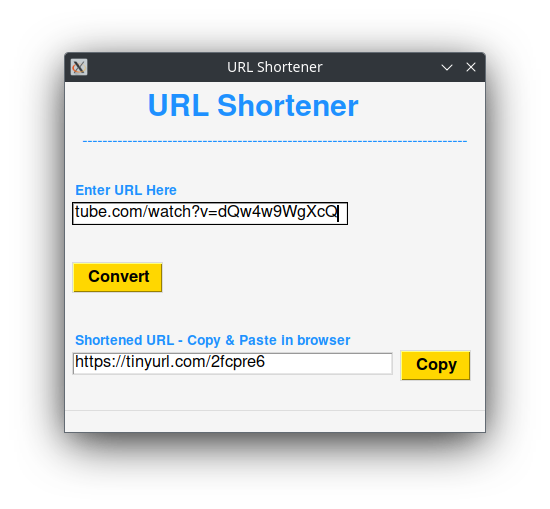
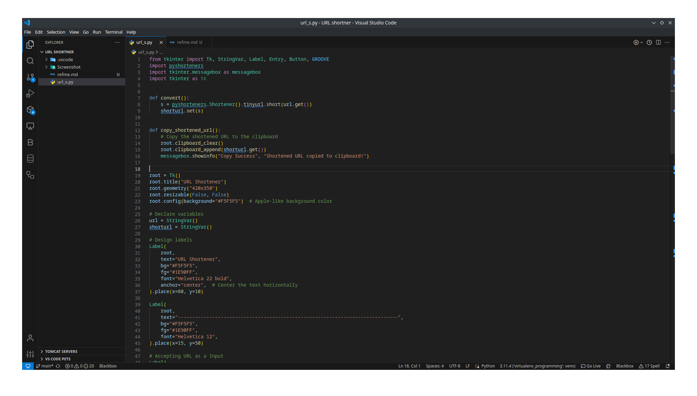
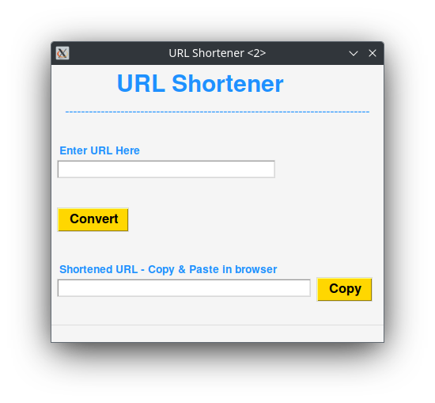

Sure! Below is a sample README file for your URL Shortener code that you can upload to GitHub:

---

# URL Shortener

URL Shortener is a simple Python application built with Tkinter that allows users to shorten long URLs using the TinyURL service.

## How to Use

1. Clone the repository to your local machine.
2. Make sure you have Python 3.x installed.
3. Install the required dependencies using `pip install -r requirements.txt`.
4. Run the `url_shortener.py` script using `python url_shortener.py`.
5. Enter the long URL in the input field and click the "Convert" button.
6. The shortened URL will be displayed in the corresponding input field.
7. To copy the shortened URL to the clipboard, click the "Copy" button.

## Screenshots

<figure class="video_container">
  <video controls="true" allowfullscreen="true">
    <source src="screenshot/url_s_video.mp4" type="video/mp4">
  </video>
</figure>

## Dependencies

- Python 3.x
- pyshorteners

## Contributing

Contributions are welcome! If you have any suggestions or find any issues, feel free to open an issue or submit a pull request.

## Acknowledgments

The URL Shortener application is built using the [pyshorteners](https://pypi.org/project/pyshorteners/) library.

